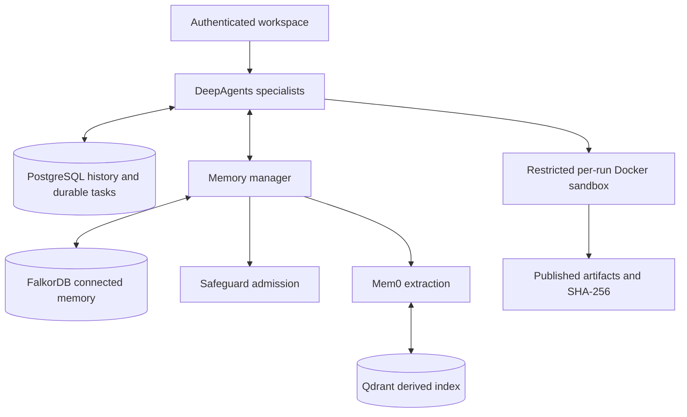
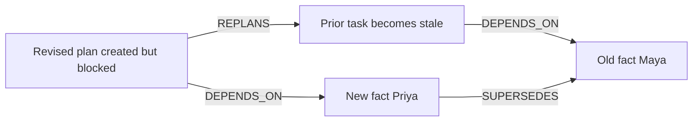
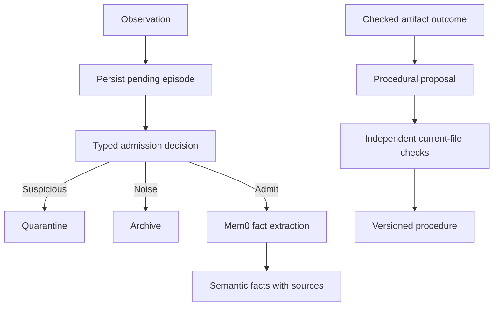

# ENGRAM flowchart sources

## Architecture

```mermaid
flowchart TD
  UI[Authenticated workspace] --> Team[DeepAgents specialists]
  Team <--> PG[(PostgreSQL history and durable tasks)]
  Team <--> MM[Memory manager]
  MM <--> F[(FalkorDB connected memory)]
  MM --> Admission[Safeguard admission]
  MM --> Mem0[Mem0 extraction]
  Mem0 <--> Q[(Qdrant derived index)]
  Team --> Box[Restricted per-run Docker sandbox]
  Box --> Artifacts[Published artifacts and SHA-256]
```

## Causal revision

```mermaid
flowchart LR
  Prior[Prior task becomes stale] -->|DEPENDS_ON| Old[Old fact Maya]
  New[New fact Priya] -->|SUPERSEDES| Old
  Plan[Revised plan created but blocked] -->|REPLANS| Prior
  Plan -->|DEPENDS_ON| New
```

## Procedure lifecycle

```mermaid
flowchart LR
  Publish[Publish exact artifacts] --> Propose[Propose version and manifest]
  Propose --> Verify[Different run executes fresh checks]
  Verify --> Hash[Verify actual current file hashes]
  Hash --> Active[Activate version]
  Active --> Reuse[Prepare exact version in fresh run]
  Reuse --> Check[Execute fresh checks and retain receipt]
  Check --> Measure[Measure calls tokens and time]
```

## Admission and consolidation

```mermaid
flowchart TD
  Input[Observation] --> Pending[Persist pending episode]
  Pending --> Judge[Typed admission decision]
  Judge -->|Suspicious| Quarantine[Quarantine]
  Judge -->|Noise| Archive[Archive]
  Judge -->|Admit| Extract[Mem0 fact extraction]
  Extract --> Semantic[Semantic facts with sources]
  Outcome[Checked artifact outcome] --> Propose[Procedural proposal]
  Propose --> Independent[Independent current-file checks]
  Independent --> Procedure[Versioned procedure]
```
